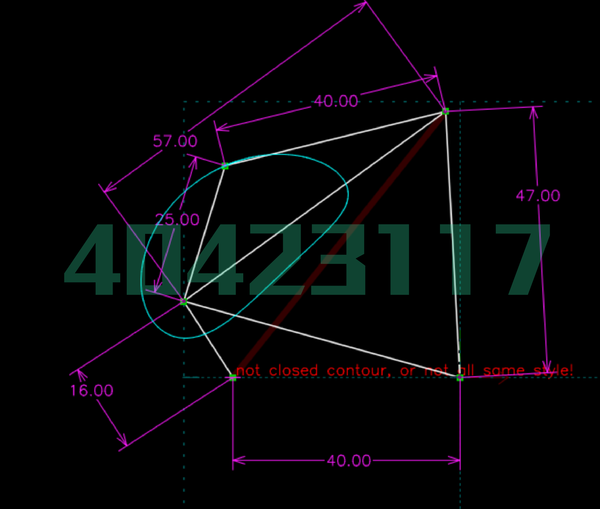
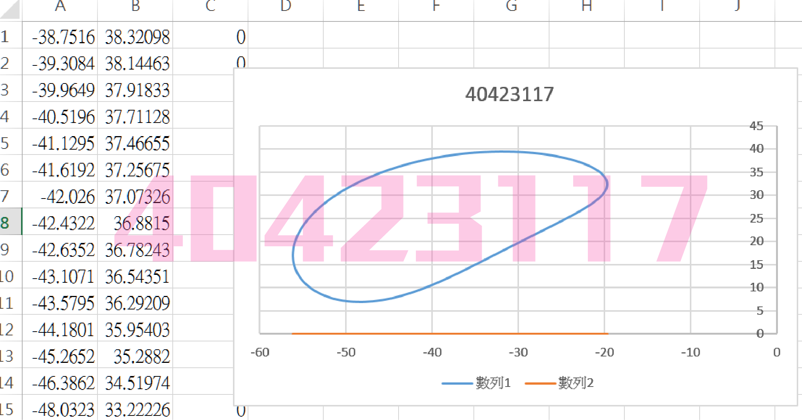

Title: 平面機構模擬
Date: 2016-11-17 15:00
Category: 2016fallcadpa
Tags: solvespace, 零件圖繪製
Author: 40423117

第十週課程內容整理

<!-- PELICAN_END_SUMMARY -->

### Solvespace 平面四連桿機構模擬

直接利用 Solvespace Analyze-Trace Point-Stop Trace 得到下列繞行路徑:

將所得到的點座標 .csv 以 Excel 畫圖, 得到:

