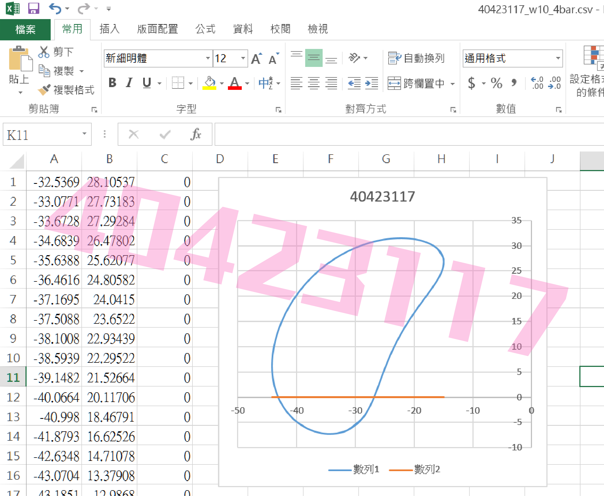

Title: [Week 10] 課程內容整理
Date: 2016-11-17 15:00
Category: 2016fallcadpa
Tags: solvespace, 零件圖繪製
Author: 40423117

[Week 10] 第十週課程內容概要整理。

1. 建立了一個近端的 https 伺服器按鈕
2. Solvespace 平面四連桿機構模擬
3. 利用Brython與.csv座標，建立線上畫布

<!-- PELICAN_END_SUMMARY -->

### 影片示範

  * SolveSpace_四連桿_Trace_Point_tutorial_40423117 
<iframe width="560" height="315" src="https://www.youtube.com/embed/SvzbU2YYAwA?rel=0" frameborder="0" allowfullscreen></iframe>

  * CSV_EXCEL_TO圖檔_tutorial_40423117 
<iframe width="560" height="315" src="https://www.youtube.com/embed/L__eySIuBTk?rel=0" frameborder="0" allowfullscreen></iframe>

### 內文

### 建立 @button https server

特別建立了一個近端的 https 伺服器按鈕, 而且為了能夠獨立於 Leo Editor 運作, 特別採用執行緒的架構編寫:

<pre class="brush: python">
import os
import subprocess
import threading
import http.server, ssl

def domake():
    # build directory
    os.chdir("./../")
    server_address = ('localhost', 8443)
    httpd = http.server.HTTPServer(server_address, http.server.SimpleHTTPRequestHandler)
    httpd.socket = ssl.wrap_socket(httpd.socket,
                                   server_side=True,
                                   certfile='localhost.crt',
                                   keyfile='localhost.key',
                                   ssl_version=ssl.PROTOCOL_TLSv1)
    print("8443 https server started")
    httpd.serve_forever()

# 利用執行緒執行 https 伺服器
make = threading.Thread(target=domake)
make.start()
</pre>

### Solvespace 平面四連桿機構模擬

直接利用 Solvespace Analyze-Trace Point-Stop Trace 得到下列繞行路徑:

將所得到的點座標 .csv 以 Excel 畫圖, 得到:

### 建立 Brython 畫布

<!-- 導入 Brython 標準程式庫 -->

<!-- 啟動 Brython -->

<!-- 以下實際利用  Brython 畫兩條直線 -->

<canvas id="fourbar" width="600" height="400"></canvas>

