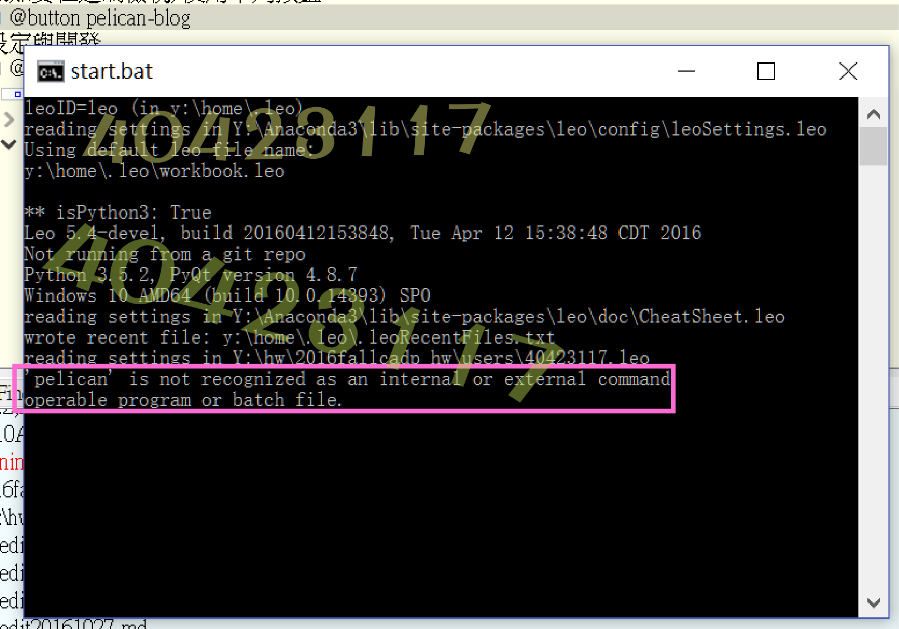
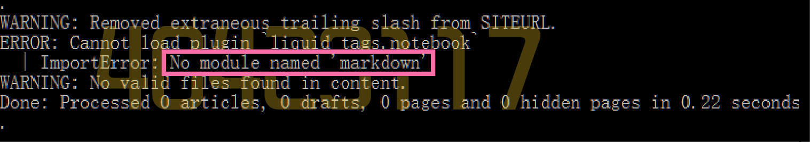

Title: 模組缺少解決辦法
Date: 2016-11-19 20:00
Category: 2016fallcadpa
Tags: python, module
Author: 40423117

[<b>非課程內容相關，不用複製</b>]
本篇文章適用於使用今年新版課程bat套件問題解決。

<!-- PELICAN_END_SUMMARY -->

### 缺少模組問題

剛剛使用今年新版的[ana2016fall_08]，開啟 LeoEditor之後，要在近端觀看倉儲網誌時，發現都沒有更新我所改的內容，故到 Start.bat 內查看問題，後來解決了問題一之後，又跑出沒有安裝markdown模組，所以又安裝了，之後便暢行無阻~~ happy :)

### 問題一

解決方法：<code>pip install pelican</code>

### 問題二

解決方法：<code>pip install markdown</code>

