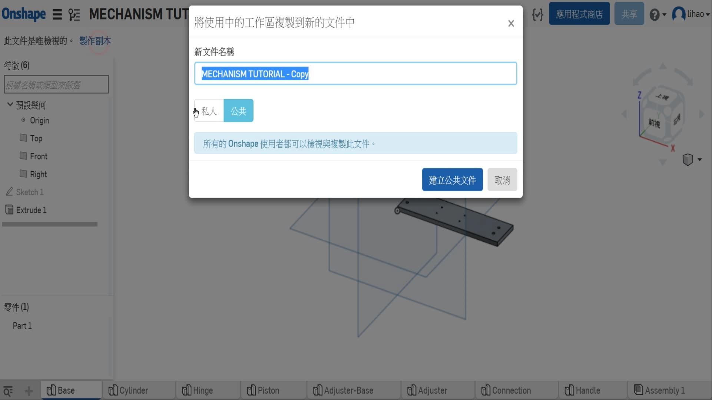
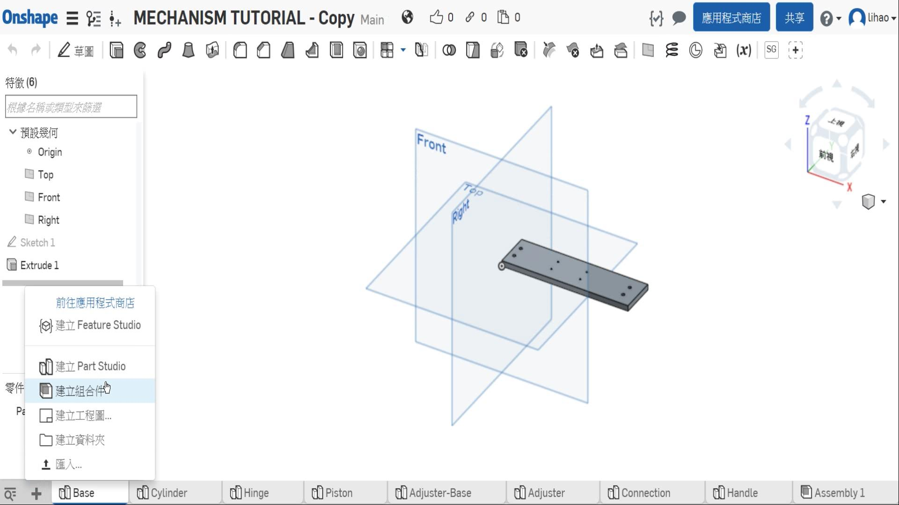
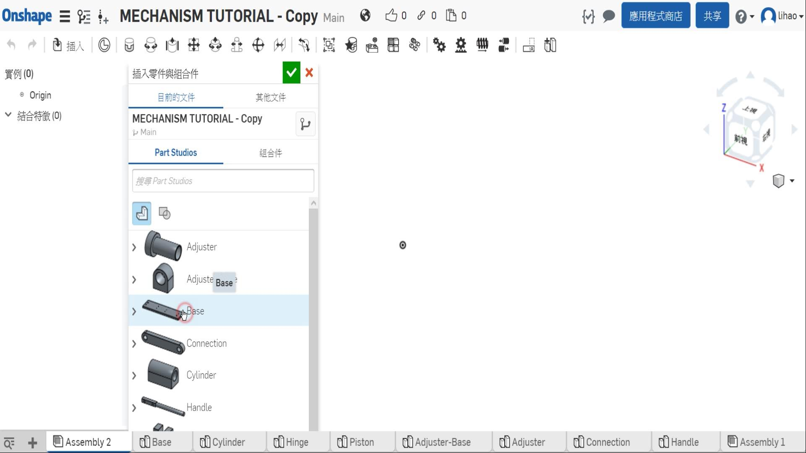
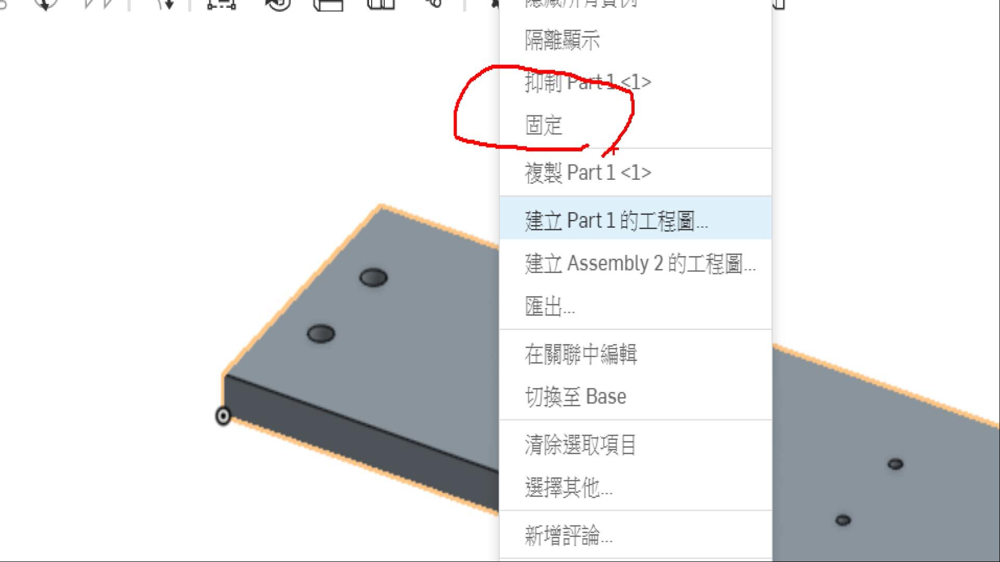

Title: [圖文篇] MECHANISM TUTORIAL
Date: 2016-12-29 15:00
Category: 2016fallcadpa
Tags: python, module
Author: 40423117

[圖文篇] MECHANISM TUTORIAL

<b>避免懶人包的篇幅過大，故獨立出一篇！</b>

<!-- PELICAN_END_SUMMARY -->

本篇教學的是偷吃步篇，因為零件我已經都畫好了，但是忘記拍攝影片了，所以就直接讓大家COPY副本，學學怎麼將零件組裝起來。

如果你想要自己畫零件跟組合的話，尺寸跟視圖下載點在這：[MECHANISM TUTORIAL](https://40423117.github.io/2016fallcadp_hw/data/ProEMechanism.pdf) 

<small><b>貼心提醒：</b>本篇只貼一開始操作的部分，其他畫圖的地方，都是非常簡單的，影片當中每點一次按鈕，都會放大給大家看！</small>

### 圖文篇

1. 首先到[MECHANISM TUTORIAL](https://cad.onshape.com/documents/587ed6a0f6c36b10bb34d70d/w/e79b1dcae6d965038beb5cc5/e/30483adc37828dc064ad63e9) 建立一個一樣的副本

2. 點選左下角的+，選擇組合件

3. 選擇底座(第一個零件)

4. 點選底座右鍵，將它固定

### 影片示範

<iframe width="560" height="315" src="https://www.youtube.com/embed/PR4Kg_fcd6k?rel=0" frameborder="0" allowfullscreen></iframe>